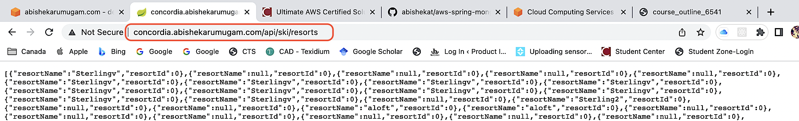
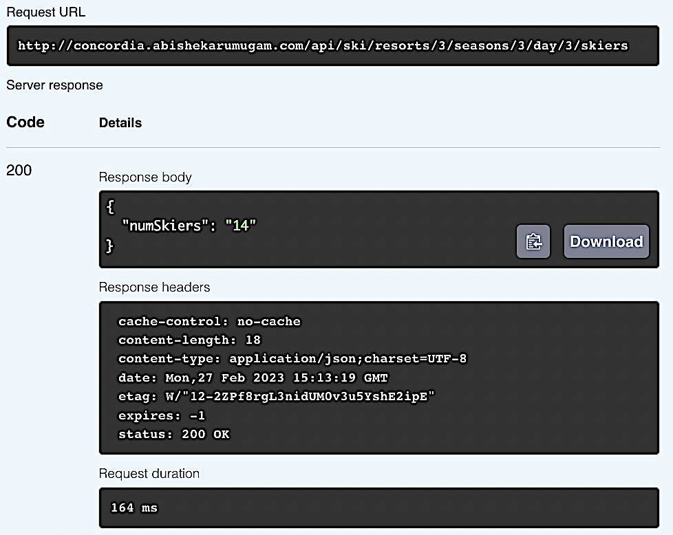
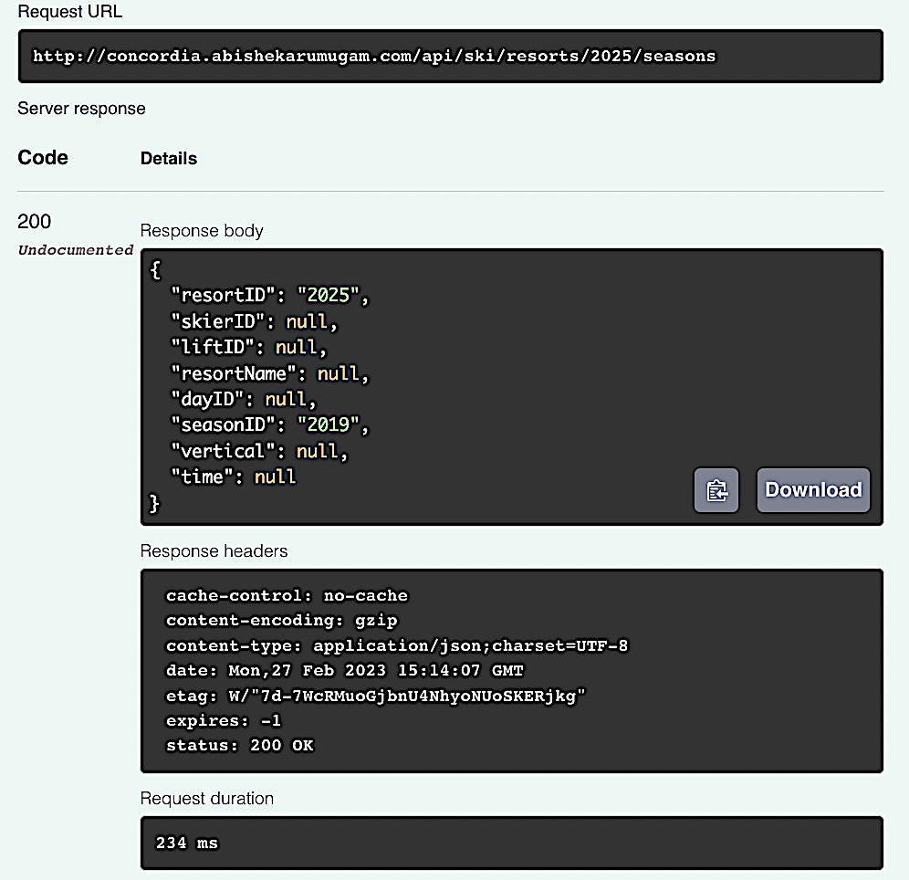
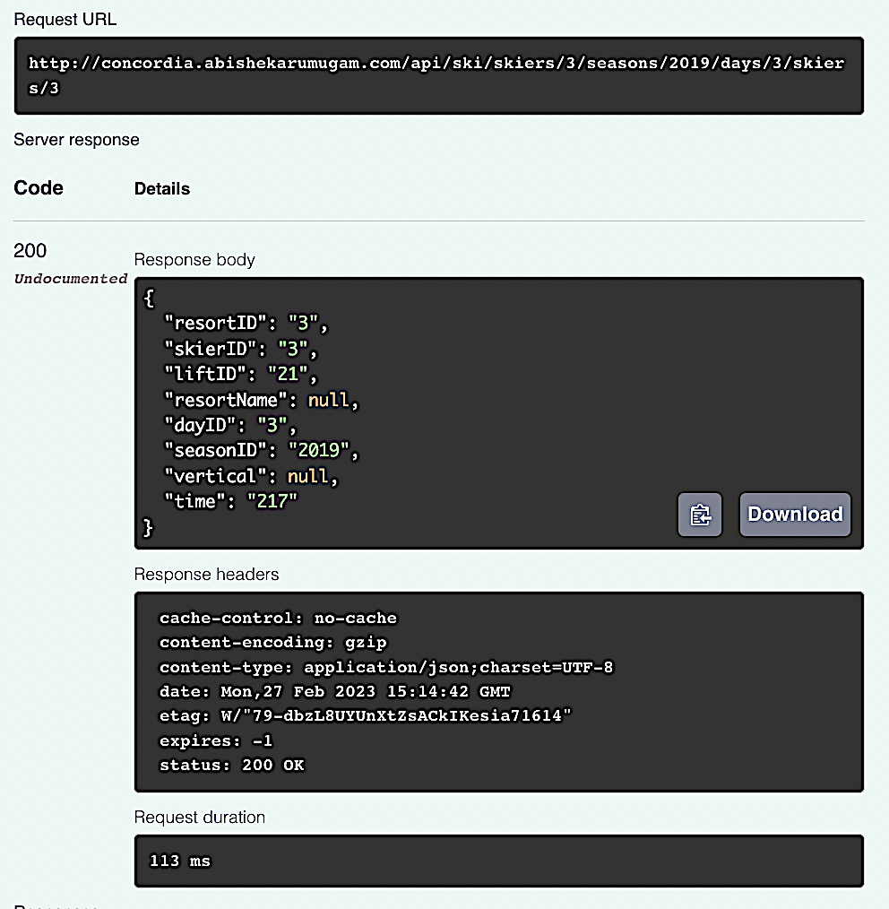
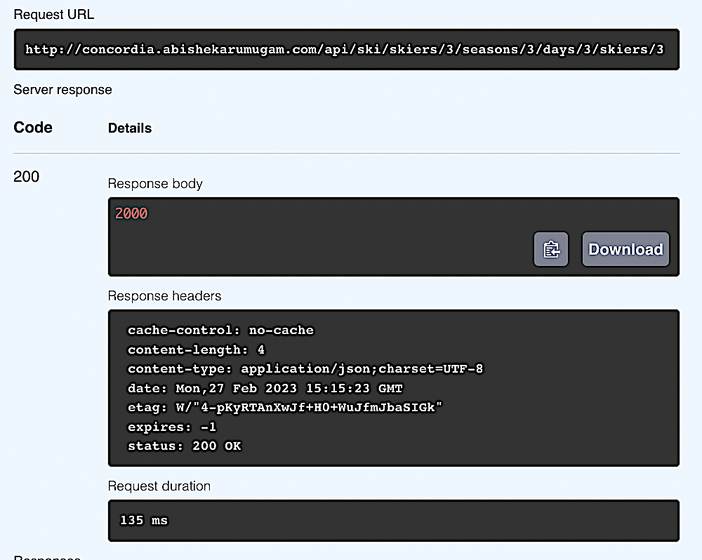
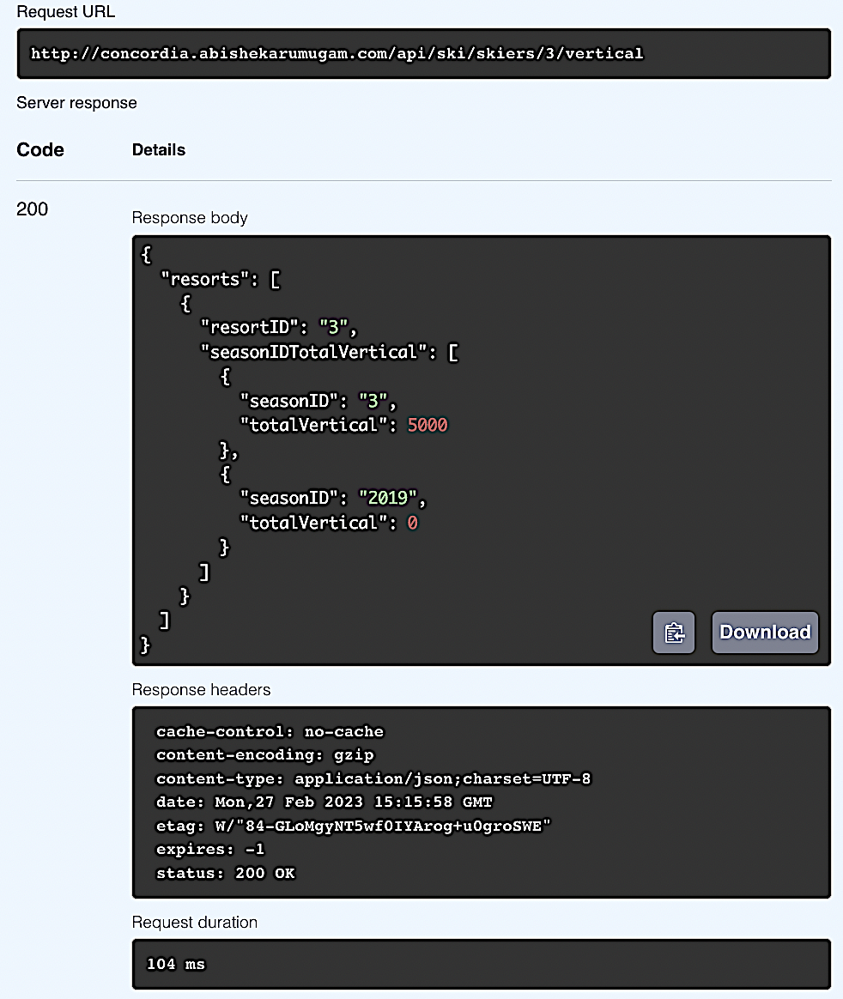
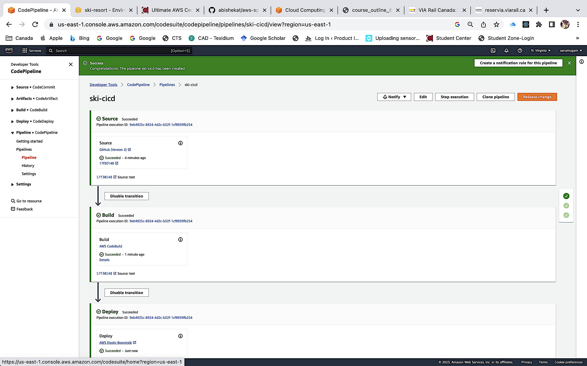
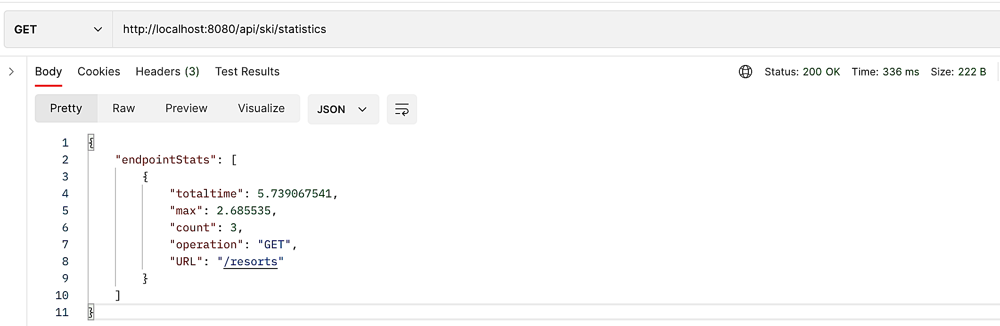

# aws-spring-mongo-ski-webapp

[Abishek Arumugam Thiruselvi](https://www.abishekarumugam.com)('40218896')

# Running the Application in Eclipse
#### Prerequisites: Eclipse IDE plugins Spring Tools 3, Git, Java 17 or greater, Maven 3.9 or higher.
1. Open Git Perspective in Eclipse and clone this [repository](https://github.com/abishekat/aws-spring-mongo-ski-webapp)

2. Import the project into project explorer.

3. Right-click on the project in the project explorer 

   ```shell
   run -> clean install
   ```
4. To run the application right-click on the project in the project explorer 

   ```shell
   run > java application / junit
   ```
5. To run the application on terminal 

   ```shell
   mvn spring-boot:run
   ```

# AWS Environment

####  Follow the steps from this [URL](https://github.com/youyinnn/distributed_system_jetty_helloworld/blob/main/Oracle%20Cloud%20VM%20Setup.md) and clone this project

##### Elastic Beanstalk:
  ```shell
Create an application with the below configuration.
a)	Choose a platform as java.
b)	Version 3.4.4, Corretto 17 – Linux 2.
```
##### Github:
  ```shell
Maintain the github repository and generate git tokens if necessary.
```
##### CodePipeline:
  ```shell
Create a buildspec file which has the commands for pre-build and post-build. Webhook the github repository to the code pipeline. Configure the deploy stage as Elastic Beanstalk and click save. The CI/CD starts automatically.
```
  
# Client
#####  1.	Data Generation:
  ```shell
The client sends 10K POST requests with the below configuration.
1)	skierID - between 1 and 100000 
2)	resortID - between 1 and 10 
3)	liftID - between 1 and 40 
4)	seasonID - 2022 
5)	dayID - 1 
6)	time - between 1 and 360
```
##### 2.	Multithreaded Client:
 ```shell
To POST 10K data, we use ExecutorService which runs the tasks asynchronously. At the start 32 thread pools were created and each thread sends 1K POST request and shuts down on completion.
A lift ride event is generated by a single thread and is made available for others. This is achieved by ConcurrentLinkedQueue which polls the event and ensures thread safety. The basic HTTP validation is handled in the application.
```
##### 3.	Client JUnit Testing:
 ```shell
After the completion of the spring-boot test. The client's characteristics are as follows.
1)	All the requests are asserted success.
2)	Zero failure request.
3)	The total time taken for both the client process and individual posts to complete is calculated. The individual data is stored as a CSV file.
4)	From the CSV file, we were able to calculate the min, max, median, and 99 percentiles.
```
##### 4.	Handling Errors: 
 ```shell
The requests will retry about 5 times with an interval of 500 milliseconds. The basic HTTP validation is done.
```
 
   
# OpenAPI
 ```shell
OpenAPI YAML is in src/main/resources/openapi-def.yaml
```

## RESULTS

#### Get: Ski resorts && Domain Configured


#### Post: Create ski activity


#### Get: number of unique skiers at the resort/season/day


####  Get:  a list of seasons for the specified resort.


####  Post: Add a new season for a resort.


####  Post: Create a new lift ride for the skier. 


####  Get: ski day vertical for a skier.


####  Get: The total vertical for the skier for specified seasons at the specified resort. 


####  Get: Ski statistics


#### CI-CD Pipeline



#### Resort Statics
   ```shell
   Should send many get request "/resort" before sending "/statistics"
   ```


## Other file

```shell
   PATH : src/main/resources/post-performance.csv
   PATH : src/main/resources/openapi-def.yaml
   ```

### UNIVERSITY

 [CONCORDIA UNIVERSITY](https://www.concordia.ca/).
  
